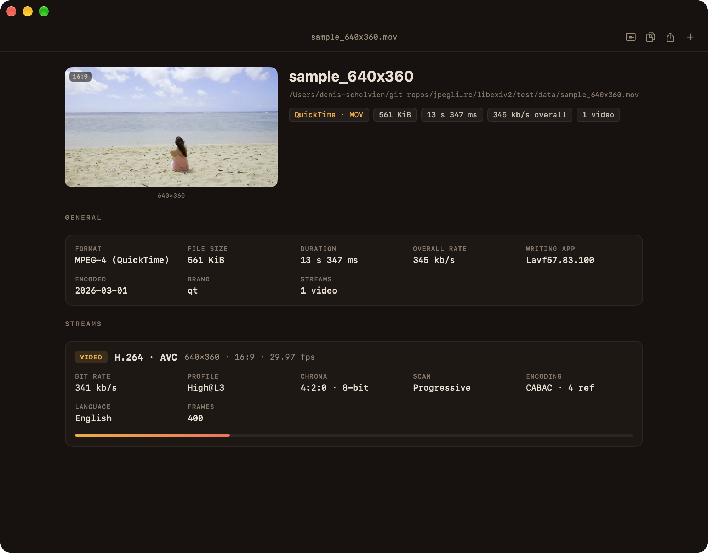
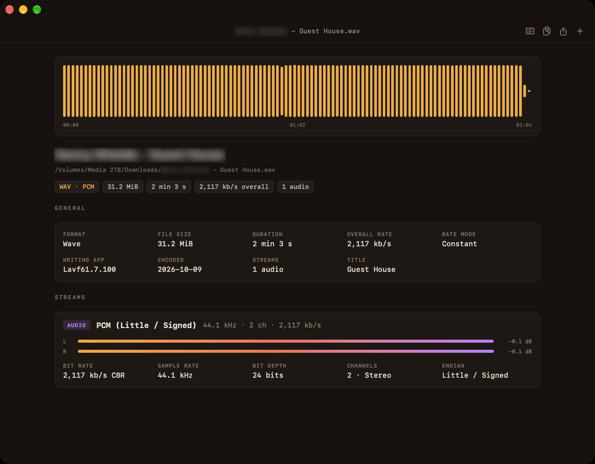

  

<h1 align="center">MediaSpy</h1>

<b>See what's inside your media files.</b>

MediaSpy is a Mac app that shows you everything about a video, audio or image file. You can see
the codec, resolution, frame rate, bit depth, audio channels, HDR and more, laid out so it's easy to
read.

Drop a file in and you get a clear summary first. Every technical detail is there too when you want it.

## What it shows you

- **The essentials at a glance.** Format, file size, duration and bitrate sit right at the top,
  followed by a card for each video, audio and subtitle track in the file.
- **Video.** Codec, resolution, aspect ratio, frame rate, profile, color format and bit depth, and
  HDR formats such as HDR10 and Dolby Vision. A preview frame shows you which file you're looking at,
  and it works for both landscape and portrait videos.
- **Audio.** Codec (including Dolby Atmos), channels, sample rate and bit depth. You also get a
  waveform of the whole track and peak level meters for each channel.
- **Subtitles.** Every subtitle track with its language and format, marked Default or Forced where
  that applies.
- **Images.** Resolution, bit depth and color space for JPEG, PNG, HEIC, JPEG XL and other image
  formats.
- **Every field, when you need it.** Switch to the full list of everything the file contains, and
  search it (⌘L).

## Made for how you work

- **Right from Finder.** Right-click any file and choose **Services ▸ Get Media Info**, or
  **Open With ▸ MediaSpy**.
- **Quick Look.** Select a file in Finder and press Space to see its media info. This works even for
  files macOS can't preview on its own, like MKV.
- **Many files at once.** Drag in a whole batch and switch between them in the sidebar.
- **Copy and share.** Copy the full report with one click (⇧⌘C), or export it as Text, HTML, JSON
  or XML.
- **Shows info, doesn't play.** MediaSpy is not a player. It reads how the file is built instead of
  playing it, so even large files open in a moment.

## Works with the formats you use

MKV, MP4, MOV, AVI, MPEG-TS, WebM, MP3, AAC/M4A, FLAC, WAV, AIFF, JPEG, PNG, HEIC, JPEG XL, GIF
and many more.

## Download

Get the latest version from the [Releases](../../releases/latest) page. Open the disk image and drag
MediaSpy into your Applications folder.

MediaSpy needs **macOS 14 Sonoma or later** and a **Mac with Apple silicon**. It is signed and
notarized by Apple.

## Credits

MediaSpy uses [MediaInfoLib](https://mediaarea.net/en/MediaInfo) from MediaArea, the same engine
behind MediaInfo, so its results are just as accurate. Licenses for all included third-party
software are in [THIRD-PARTY-NOTICES.md](THIRD-PARTY-NOTICES.md) and under **About MediaSpy** in
the app.
